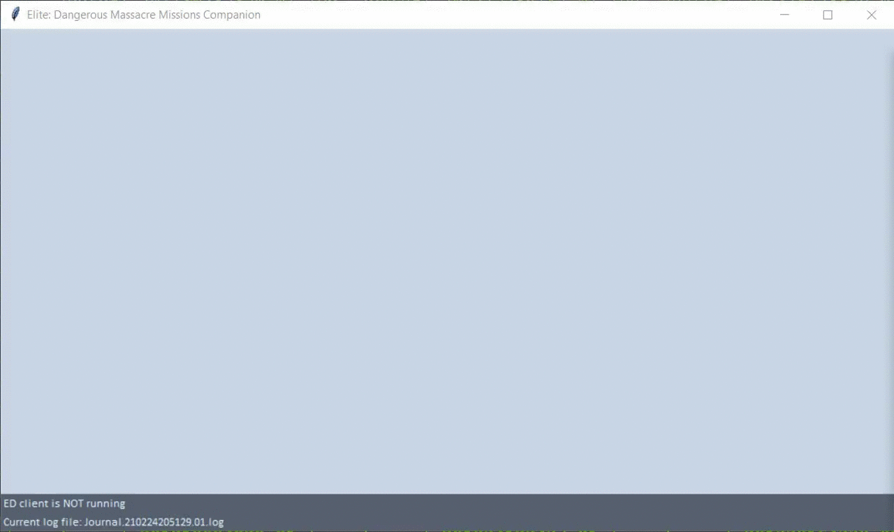

# EDMMC (ED Massacre Mission Companion)

## A GUI helper for stacking pirates massacre missions in Elite: Dangerous

Example of a simulated stacking run with my previous log.



### What is EDMMC

If you have ever stacked pirates massacre missions in Elite: Dangerous, you
must have realized that managing these missions can be extremely difficult.
More specifically, it's difficult to know

* how many missions you accepted for each faction,
* how many kills you need for each faction,
* what's the current progress for each mission.

As a result, I had to use Excel to get my missions organized and you know it
sucks!

So here is `EDMMC`. Before I get started, there are two
limitations in this program.

* I'm no professional code. More importantly, I have never built GUI before, so
  the UI might be naive, but this is pretty the best I can offer with Tkinter.
* Due to technical issues, I CANNOT precisely track the mission progresses,
  which means that you may find the progress shown in `EDMMC` is inaccurate.
  I will talk about more details later.

### Features

* Monitor all you current massacre mission and organize them based on factions.
* Count the mission and faction specific progress based on the `Bounty` event.

### How it works

Much information in this part was inspired by
[Elite Dangerous Player Journal][].

All data are extracted from the game journal files stored in

```text
%USERPROFILE%\Saved Games\Frontier Developments\Elite Dangerous
```

Each line of these journal files is a JSON format string. There are a few entries
related to missions.

* Resume missions from previous sessions

  ```json
  {
    "timestamp": "2017-10-02T10:37:58Z",
    "event": "Missions",
    "Active": [
        {
            "MissionID": 65380900,
            "Name": "Mission_Courier_name",
            "PassengerMission": false,
            "Expires": 82751
        }
    ],
    "Failed": [],
    "Complete": []
  }
  ```

* Mission accepted
  
  ```json
  {
    "timestamp": "2018-02-28T12:06:37Z", "event": "MissionAccepted",
    "Faction": "Official i Bootis Liberty Party",
    ......
    "Influence": "Med",
    "Reputation": "Med",
    "Reward": 2686155,
    "MissionID": 65393626
  }
  ```

* Mission redirected

  ```json
  {
    "timestamp": "2017-08-01T09:04:07Z",
    "event": "MissionRedirected",
    "MissionID": 65367315,
    "NewDestinationStation": "Metcalf Orbital",
    "OldDestinationStation": "Cuffey Orbital",
    "NewDestinationSystem": "Cemiess",
    "OldDestinationSystem": "Vequess"
  }
  ```

  This event happens when you have fulfilled the number of kills required by
  the mission and the mission is redirected back to the station.

* Mission abandoned/completed/failed

  Skip. Pretty straightforward.

* Bounty claimed
  
  ```json
  {
    "timestamp": "2018-04-17T11:11:02Z",
    "event": "Bounty",
    "Rewards": [
        {
            "Faction": "Nehet Patron's Principles",
            "Reward": 5620
        }
    ],
    "Target": "empire_eagle",
    "TotalReward": 5620,
    "VictimFaction": "Nehet Progressive Party"
  }
  ```

  This event happens when you kill a criminal. However, the log does NOT say if
  this criminal is your "MISSION TARGET". Sure, the log records the faction
  which the criminal belongs to, but NOT all wanted ship from your target
  faction are your mission targets.

So here is how the program works

* All missions for the same faction is based on "first come, first serve" rule.
  There is no way I can know the current progress of the mission, so it's
  assumed to be 0.
* Whenever a criminal of the target faction is killed, the first active mission
  of each faction will move forward by 1.
* When the mission is redirected, the status is changed to "Done". If there is
  a discrepancy between the progress and kill counts, I will force sync the
  progress. I guess you can understand that there is no other way.
* Next kills will be counted towards the next mission in queue. Missions in
  "Done" status will be removed from the list will the reward is claimed.

### TODO

The code is still in very preliminary state. Many things can be greatly
improved.

* Save faction/mission status and rationally restart on the next launch.
* Add a warning for non-pirate massacre missions.
* Add a button to "calibrate" the mission progress.
* Add settings for stuff like color and font, etc.
* A better way to watch file changes, like [watchdog][].
* Use separated processes for processing log files and tk.
* Logging and debugging options.
* Unit tests, CI and docs, etc.

### Credits

This package was created with [Cookiecutter][] and the
[audreyr/cookiecutter-pypackage][] project template. The colors used in the
built-in theme are taken from [flatuicolors][].

  [Cookiecutter]: https://github.com/audreyr/cookiecutter
  [audreyr/cookiecutter-pypackage]: https://github.com/audreyr/cookiecutter-pypackage
  [Elite Dangerous Player Journal]: https://elite-journal.readthedocs.io/en/latest/
  [watchdog]: https://pypi.org/project/watchdog/
  [flatuicolors]: https://flatuicolors.com/